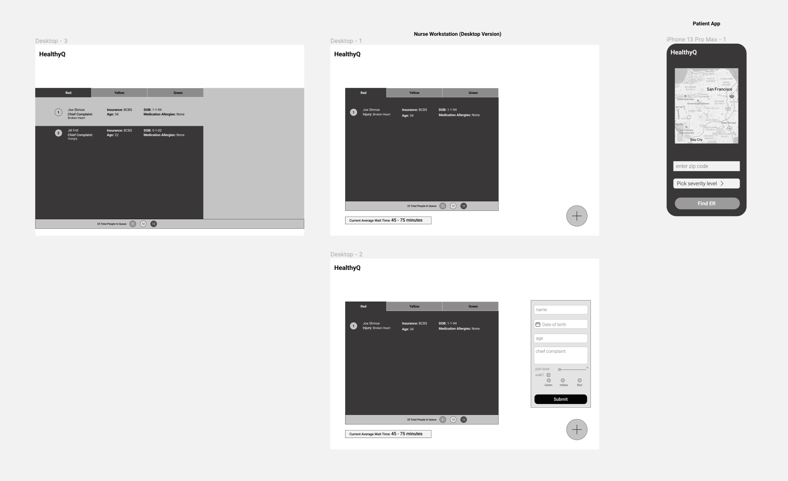
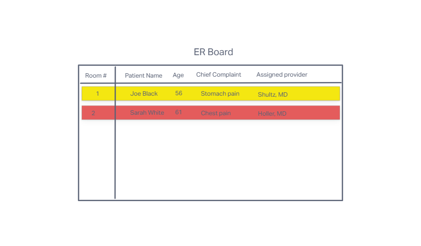
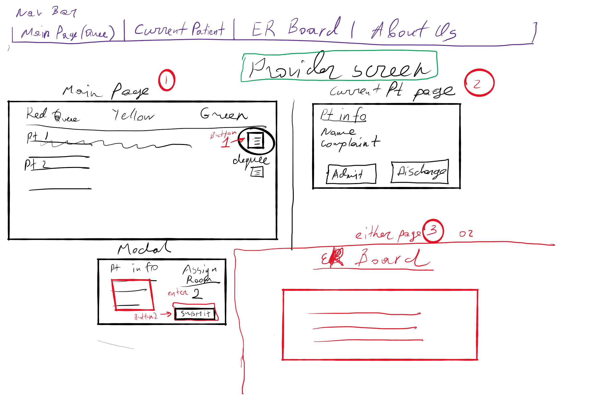

### Project Description

An app that can be used by front desk triage personnel and providers of an emergency department to accept and assign patients into queues based on priority of their symptoms.

### Team members

- Lorenzo Ortega
- Ayrat Gimranov
- Jeremy Brazell
- Tom McGuire

### Deployments (in progress)

🏠 GitHub Organization Home

💻 Frontend

💻 Backend

### Wireframes

### Software Requirements

[click here](./requirements.md) for software requirements

### User Stories

User Stories:

- Patients
  - As a patient I would like to be able to see the ratings of each ER that appear in my search so that I can make informed choices about what ER I go to.
  - As a patient I would like to access the website on my mobile device so that I can view the average wait time (duration or number of patients) on a computer / on my phone.
  - As a patient I would like to be able to compare wait times of surrounding ER’s in my area so that I can make informed choices about what ER I go to.

- Triage Nurses
  - As a triage nurse I would like to input patient information after triage of walk-in patients so that I can assign them to the appropriate waiting queue.
  - As a triage nurse I would like to be able to update patient priority so that I can accurately assign patients based on changing conditions.

- Triage Nurse / Provider
  - As a nurse or provider I would like to know the average queue wait for each priority value or queue so that I can see how busy the ER is.
  - As a nurse or provider I would like to register/login so that actions under my name are traceable to myself.

- Providers
  - As a provider I would like to know who the next highest-priority patient in the waiting line is, so that I can attend to that patient.

- Admin
  - As an administrator I would like to be able to login as an administrator so that I can perform admin functionality.
  - As an admin I would like to be able to add user roles for providers and nurses.
  - As an admin I would like to be able to delete a user. 
  - As an admin I would like to be able to see statistics for each doctor / nurse (stretch).

### Domain Modeling (in progress)

in progress

### Database Schema Diagram (in progress)

- create a diagram of all your application data models, each in it’s own collection (or table)

- Be sure to identify the relationships (if any) between each of your data models:

1. Does a single item in your database “belong to” just one other item in your database? For example, a person has one passport, and a passport belongs to a single person.
2. Does a item in your database “belong to” multiple other items in your database? For example, a house has many residents, and each resident has one primary house.
3. Do many items in your database relate to many other items in your database? For example, a band has many musicians, and a musician can be in many bands.
 
- Also, include for each seperate collection:

1. The name of each property stored in the collection.
2. The required data type.
3. An indication if this collection is associated with another collection.

- include explanation of each data model and it’s responsibility in the application